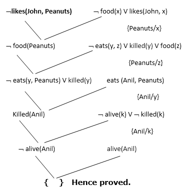

# CSCI561_AI_FirstOrderLogicResolution
  ## Problem Definition
  RipeApe pharmacy is developing a self-service automated system to alert customers about potential drug interactions for both prescription and over-the-counter drugs. Many medications should not be taken together or should not be taken if a patient has certain symptoms and allergies. Evaluating all the criteria for whether a patient can take a particular medication requires the patient's medical history and expert knowledge from a health care provider. The system, however, can provide an instant guideline to keep patients informed and minimize the risks. You are assigned by RipeApe to develop a beta version of the system using the **first order logic inference.** Patient history and drug compatibility data will be encoded as first order logic clauses in the knowledge base. The program takes a query of new drug list and provide a logical conclusion whether to issue a warning.
 
 Using **First Order Logic** to solve this problem.
 
 ## Proof by Contradiction
 
 [Resolution - Proof by Contradiction](https://en.wikipedia.org/wiki/Resolution_(logic) "Proof by Contradiction")
 

 ## Input Format (input.txt)
 [N = NUMBER OF QUERIES]
  [QUERY 1]
   ...
  [QUERY N]
    [K = NUMBER OF GIVEN SENTENCES IN THE KNOWLEDGE BASE]
   [SENTENCE 1]
    ...
   [SENTENCE K]
  The first line contains an integer N specifying the number of queries. The following N lines contain one query per line. The line after the last query contains an integer K specifying the number of sentences in the knowledge base. The remaining K lines contain the sentences in the knowledge base, one sentence per line.
  
**Query format:** Each query will be a single literal of the form Predicate (Constant_Arguments) or ~Predicate (Constant_Arguments) and will not contain any variables. Each predicate will have between 1 and 25 constant arguments. Two or more arguments will be separated by commas.

**KB format:** Each sentence in the knowledge base is written in one of the following forms:
1) An implication of the form p1 ∧ p2 ∧ ... ∧ pm ⇒ q, where its premise is a conjunction of literals and its conclusion is a single literal. Remember that a literal is an atomic sentence
or a negated atomic sentence.
2) A single literal: q or ~q

**Assumptions:**
1. & denotes the conjunction operator.
2. | denotes the disjunction operator. It will not appear in the queries nor in the KB given as
input. But you will likely need it to create your proofs.
3. => denotes the implication operator.
4. ~ denotes the negation operator.
5. No other operators besides &, =>, and ~ are used in the knowledge base.
6. There will be no parentheses in the KB except as used to denote arguments of predicates.
 
7. Variables are denoted by a single lowercase letter.
8. All predicates (such as HighBP) and constants (such as Alice) are case sensitive
alphabetical strings that begin with uppercase letters.
9. Each predicate takes at least one argument. Predicates will take at most 25 arguments. A
given predicate name will not appear with different number of arguments.
10. There will be at most 10 queries and 100 sentences in the knowledge base.
11. See the sample input below for spacing patterns.
12. You can assume that the input format is exactly as it is described.
13. There will be no syntax errors in the given input.
14. The KB will be true (i.e., will not contain contradictions).

## Output Format (output.txt)

For each query, determine if that query can be inferred from the knowledge base or not, one query per line:
 [ANSWER 1]
 ....
 [ANSWER N]
Each answer should be either TRUE if you can prove that the corresponding query sentence is true given the knowledge base, or FALSE if you cannot.
